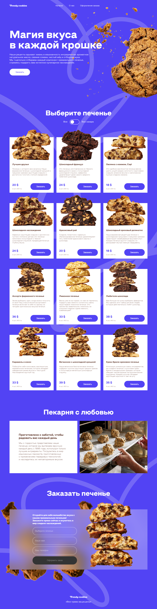

# Trendy Cookies

Trendy Cookies - это интернет-магазин, специализирующийся на продаже печенья ручной работы.

## Описание

Trendy Cookies предлагает широкий ассортимент высококачественного печенья, изготовленного вручную с использованием натуральных ингредиентов. Мы гордимся нашими уникальными рецептами и стремимся предоставить нашим клиентам неповторимый вкус и качество.

## Технологии

Проект реализован с использованием следующих технологий:

- HTML
- CSS
- Angular

## Особенности

- **Адаптивный дизайн**: Сайт разработан с учетом адаптивности для обеспечения удобного просмотра на различных устройствах.
- **Переключение валют**: Пользователи могут легко переключаться между различными валютами для удобства покупок.
- **Сортировка продуктов**: Реализована возможность сортировки печенья с зависимости от наличия в составе сахара.
- **Валидация формы заказа**: Форма заказа на сайте проходит валидацию для предотвращения ошибок ввода данных и обеспечения корректной обработки заказов.

## Скриншот

  

